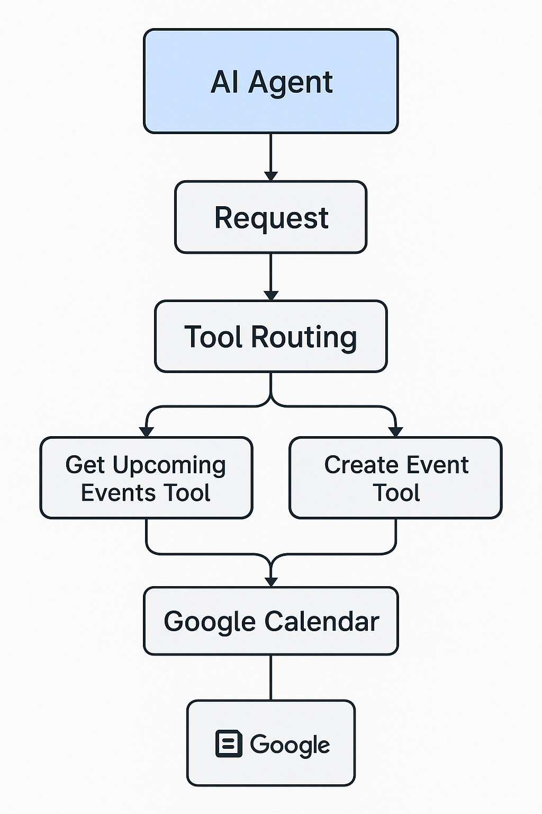

> “What meetings do I have today?”  
> “Schedule a sync with the team tomorrow at 2pm.”  
> “Cancel my 4pm demo call.”

These aren’t futuristic dreams — they’re real instructions a GenAI assistant can understand, plan, and execute using nothing but natural language and a connection to your Google Calendar.

In this post, I’ll walk you through how I built a **multi-agent GenAI calendar assistant** using Gemini, LangChain, and Google Calendar API — as part of the Google GenAI Intensive capstone.

---

## 🎯 Problem: Calendars Are Smart, But Not Helpful

While Google Calendar is powerful, the interface assumes technical know-how:

- You must click, select, type — often across time zones
- You’re forced to “think like the app”
- It doesn’t speak your language: *"Set up a quick catch-up next Thursday"*

What if you could simply **talk** to your calendar like a human?

---

## 🚀 The Solution: A Conversational Calendar Agent

Meet your executive assistant — built with GenAI.

This assistant can:
- 📅 **List** upcoming events
- ➕ **Create** new meetings
- 📝 **Rename** or update existing events
- ❌ **Delete** unwanted ones
- 🤖 Understand flexible language like “postpone all calls tomorrow”

### 🧠 Powered by:
- **Gemini 2.0 Flash** for fast LLM response
- **LangChain multi-agent** architecture
- **Google Calendar API** for real-world scheduling
- **Structured prompting** for safe function calling

---

## 🧱 Architecture



- **Planner Agent**: Parses user intent and outputs structured JSON
- **Router**: Decides if the action is listing, creating, or deleting
- **Scheduler Agent / Tools**: Executes the API calls
- **Fallback Handling**: Warns users if response is ambiguous or malformed

---

## 🧪 Sample Prompt Output

From the planner:
```json
{
  "action_type": "create_event",
  "summary": "Team Sync",
  "start_time": "2025-04-20T09:00:00",
  "end_time": "2025-04-20T10:00:00",
  "timezone": "Asia/Kolkata"
}
```

This lets us use a tool function like:

```python
def create_event(summary, start_time, end_time, timezone):
    ...
    return calendar_service.events().insert(calendarId='primary', body=event).execute()
```

---

## ⚙️ Technologies Used

- **LLM**: Gemini Flash (via `langchain-google-genai`)
- **Framework**: LangChain Agent Executor
- **APIs**: Google Calendar API (OAuth, token-based)
- **Orchestration**: Python + function calling + retry helpers
- **Validation**: JSON sanity checks to ensure safe execution

---

## 📏 Output Evaluation

We validated GenAI outputs using a schema check:
```python
def validate_planner_json(json_text):
    try:
        data = json.loads(json_text)
        return "action_type" in data
    except:
        return False
```

Without this step, the entire pipeline could break from one bad generation.

---

## ⚠️ Limitations & What's Next

### Current Limitations
- ❌ Cannot handle recurring events
- ❌ Doesn’t reschedule (yet)
- ❌ Limited natural language understanding for vague dates

### Future Potential
- 🧠 Add embeddings to track user preferences
- 🗣️ Voice assistant integration
- 👥 Multi-user calendars
- 🗓️ Smart time-slot negotiation

---

## ✅ Why It Matters

This project shows how GenAI can **translate natural language into structured action**.

The assistant bridges user intent ↔️ API calls with explainable logic, safely and reliably. It's not just a chatbot — it's a **real tool** for managing your time with language.

---

## 📚 Notebook + Code

🔗 [View the Full Notebook on Kaggle](https://kaggle.com/)  
🔧 [Source Code on GitHub](https://github.com/your-repo)

---

## 🙏 Acknowledgements

Thanks to **Google GenAI** for providing this capstone opportunity, and to the open-source community for tools like LangChain, Gemini, and Google APIs.
