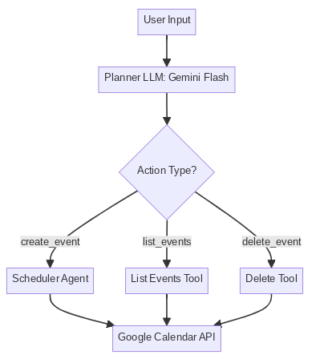

> “Hey Assistant, what’s on my calendar today?”  
> “Cancel the meeting with the team.”  
> “Can you move all my Friday calls to Monday?”

These are not commands typed into some form — they’re just natural language. And thanks to generative AI, they now work.

This is the story of how I built a **multi-agent AI assistant** that lets me manage my Google Calendar by simply talking to it — like I would to a real human assistant. No clicking. No date pickers. Just plain conversation.

---

## 🌱 Where It Started

Like many of us, I spend way too much time juggling meetings, writing reminders, and navigating calendar tabs. I wanted something simpler — something smarter.

When I joined the **Google GenAI Intensive capstone**, I saw a chance to finally build what I always imagined: a **calendar that listens**.

---

## 🧠 The Vision

Imagine you have an executive assistant.

You say: “List my events today.”  
They respond: “You have a sync at 2 and a demo at 4.”

You say: “Cancel the 4pm demo.”  
They nod and make it disappear from your calendar.

Now replace that human assistant with a polite, helpful **AI agent**, powered by LLMs and APIs — and that’s exactly what I built.

---

## 🔍 What It Can Do

This conversational assistant understands things like:

- **“Schedule a 1-on-1 with Raj tomorrow at 10am.”**
- **“What do I have on Sunday?”**
- **“Delete the AI sync call.”**
- **“Reschedule all Friday meetings to next Monday.”**

All of this happens behind the scenes using **Google Calendar API**, **Gemini LLM**, and a smart flow of agents and tools.

---

## 🧰 Tools of the Trade

Here’s the tech that made the magic possible:

- 🧠 **Gemini 2.0 Flash**: Fast, reliable LLM from Google
- 🔗 **LangChain**: For chaining prompts and agents
- 🔧 **Google Calendar API**: To make real changes in my calendar
- 🛠️ **Python** in Kaggle Notebook: The lab where I stitched it all together

---

## 🧱 Behind the Scenes

At the heart of this assistant is a **planner → scheduler pipeline**.

1. **Planner Agent** takes your sentence and turns it into a plan — like a JSON recipe:
```json
{
  "action_type": "create_event",
  "summary": "Project Sync",
  "start_time": "2025-04-20T10:00:00",
  "end_time": "2025-04-20T11:00:00",
  "timezone": "Asia/Kolkata"
}
```

2. **Scheduler Agent** then takes that plan and carries it out — using the Calendar API.

It’s a bit like one person figuring out *what* to do, and another actually *doing* it.

---

## 🖼️ Architecture in a Nutshell

<p align="center">
  
</p>

---

## 💬 What It's Like to Use It

Here's a real conversation I had with the assistant:

```
📝 Ask me anything:  What do I have today?
🤖 You have 2 events: Demo Sync at 12:00 and AI sync at 4:00 PM.

📝 Ask me anything:  Cancel the 4:00 PM event
🤖 Done! I've deleted the AI sync from your calendar.
```

And just like that, your schedule is sorted — no clicks, no confusion.

---

## ⚠️ What Didn’t Work (Yet)

Of course, not everything went smoothly.

- It struggles with recurring events
- It doesn’t handle vague terms like “evening” well
- Deletion only works if it finds the right event title

But that’s okay — it’s a first draft of something much bigger.

---

## 🔮 What Comes Next?

I’d love to take this further by:

- Giving it memory: so it learns my preferences
- Adding voice input
- Deploying it as a Slack bot or mobile app
- Letting it negotiate time slots with others

---

## 📚 Want to See the Code?

You can view the entire working prototype in this Kaggle notebook:

👉 [Kaggle Notebook](https://kaggle.com/)

---

## 🙏 Thanks, Google

This project would not have been possible without the **Google GenAI Intensive** capstone. It pushed me to build something real — something helpful — something I’ll actually use.

---

## 🧾 TL;DR

I built an AI assistant that:
- Understands natural language
- Plans what to do
- Connects to Google Calendar
- Schedules, deletes, or lists events
- Feels more like a conversation than an interface

Try building one — it’ll change how you think about time.

