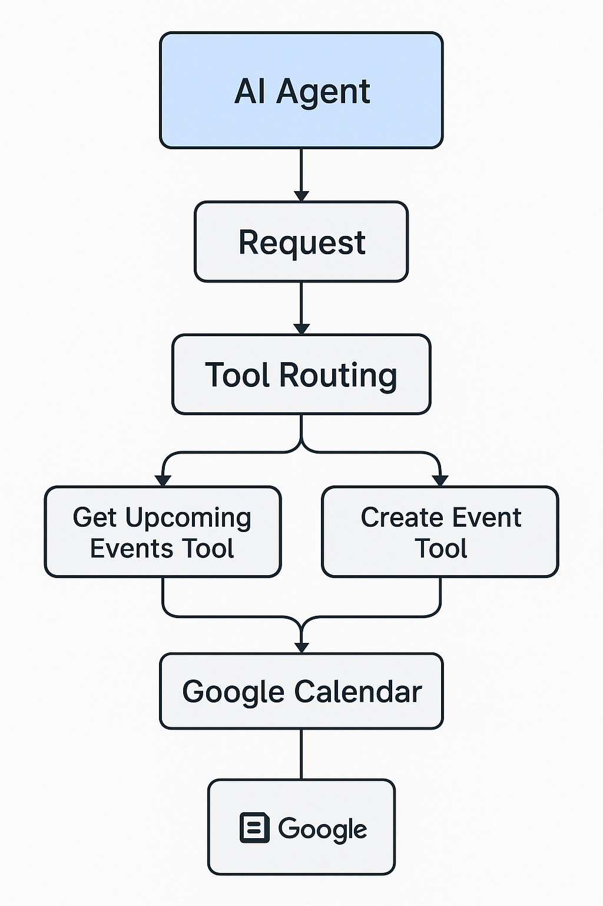

> "Imagine a world where your calendar doesn't need buttons, clicks, or commands — it simply listens to you."

This blog post walks you through my capstone project for the **Google GenAI Intensive program**, where I built a **multi-agent GenAI Calendar Assistant** that lets users manage events using natural language. From planning meetings to deleting them, this assistant uses **LLMs**, **LangChain agents**, and **Google Calendar API** — all orchestrated in Python with structured outputs and function calling.

---

## 🧩 The Problem

Calendar applications like Google Calendar are powerful but not intuitive for natural human interaction. Even in 2025, scheduling events still requires:

- Clicking through multiple menus
- Picking the correct timezone
- Entering event details in the right format

Busy professionals and executives often want a **conversational assistant** — one that understands statements like:

- “Book a team sync for tomorrow at 11”
- “What do I have today?”
- “Cancel my AI sync meeting”

This gap between structured software and unstructured human language is where **GenAI + API orchestration** shines.

---

## 💡 The Idea

The project aims to build a **Conversational Calendar Agent** that can:

- ✅ Understand user prompts via LLMs
- ✅ Plan the required action (list, schedule, delete)
- ✅ Execute the action using Google Calendar API
- ✅ Return friendly, structured responses
- ✅ Handle ambiguous queries with fallback logic

---

## 🔧 Technology Stack

| Layer | Tool/Service |
|-------|--------------|
| Language Model | **Gemini 2.0 Flash** via `langchain-google-genai` |
| Agent Framework | **LangChain Agent Executor** |
| Planning Logic | `LLMChain` with structured output |
| Tools | Custom functions for list/create/delete using Calendar API |
| Calendar API | Google Calendar API (OAuth-based access) |
| Notebook Runtime | Kaggle Notebook (Python 3.11) |
| Retry & Secrets | `google.api_core.retry`, `kaggle_secrets` |
| Evaluation | Function output validation and retry handlers |

---

## 📐 Architecture Overview



- **Planner Agent**: Parses user input like "list my events today" and returns structured JSON (`action_type`, `summary`, `start_time`, etc.)
- **Router Logic**: Uses the `action_type` to invoke the correct tool (e.g., list_events, delete_event)
- **Scheduler Tool**: Uses the structured output to create/delete/update events
- **Fallback Handler**: If planning response is invalid or missing required keys, gives helpful error messages

---

## 🔁 Multi-Agent Workflow

### Step 1 — Planner Agent:
Receives user input and returns structured instruction:
```json
{
  "action_type": "create_event",
  "summary": "AI Demo Sync",
  "start_time": "2025-04-20T09:00:00",
  "end_time": "2025-04-20T10:00:00",
  "timezone": "Asia/Kolkata"
}
```

### Step 2 — Function Tool Executor:
Validates the output, selects the correct tool:
```python
if action == "create_event":
    create_event(**parsed_json)
```

### Step 3 — Calendar API Call:
```python
calendar_service.events().insert(calendarId="primary", body=event).execute()
```

---

## 🧪 GenAI Evaluation & Prompt Strategy

To ensure the planner generates valid structured output, I used:

- Prompt examples like:  
  `"Schedule an event titled 'Project X Update' on Friday at 4pm for 1 hour"`
- Instructions that require `summary`, `start_time`, `end_time`, and `action_type`
- A validator function to reject incomplete outputs:
```python
def validate_planner_json(json_text):
    try:
        data = json.loads(json_text)
        return "action_type" in data
    except:
        return False
```

This made the system robust to hallucinations and inconsistent LLM generations.

---

## 🧠 Interaction Examples

Here are some example interactions:

- **User**: “List my calendar events for today”  
  **Agent**: Lists all events with time and summary.

- **User**: “Cancel the AI sync meeting”  
  **Agent**: Locates event by name and deletes it via API.

- **User**: “Schedule a sync call on Sunday at 10 AM for 30 mins”  
  **Agent**: Planner parses it and Scheduler creates the event.

All interactions are conversational, and the assistant gives human-like responses (e.g., “✅ Event created”, or “❌ No event found by that name”).

---

## ⚠️ Limitations

| Issue | Description |
|-------|-------------|
| 🎯 Deletion | Currently deletes by exact title match only |
| 🔁 Recurring Events | Not yet supported |
| 🧠 LLM Misfires | Sometimes fails to extract intent or action_type |
| 🕓 Timezones | Assumes "Asia/Kolkata" unless overridden |
| 📣 Voice Support | No frontend integration for audio/text yet |

---

## 🔮 Future Improvements

- Use **embeddings** to remember user preferences
- Add **rescheduling logic** and **conflict detection**
- Enable **bulk actions** (“Clear all Friday meetings”)
- Deploy as a **voice-based mobile assistant**
- Integrate with **Slack or Gmail** for richer workflows

---

## 📌 Notebook and Code

- 🔗 [Kaggle Notebook (Interactive Demo)](https://kaggle.com/)
- 💻 GitHub Repo (Coming Soon)
- 📎 [Blog Markdown Source](https://your-site.com/_posts/2025-04-18-genai-calendar-assistant.md)

---

## 🙏 Acknowledgements

Thanks to the **Google GenAI Intensive team**, the LangChain open-source community, and Gemini for enabling this exciting capstone journey.

---

## ✨ Final Thoughts

This project isn’t just a tech demo — it’s a glimpse into how **natural language interfaces can drive real-world automation**. Whether you’re a busy manager or an ML enthusiast, this assistant shows how **LLMs + APIs = action**.

Stay tuned — the AI Assistant is just getting started.
